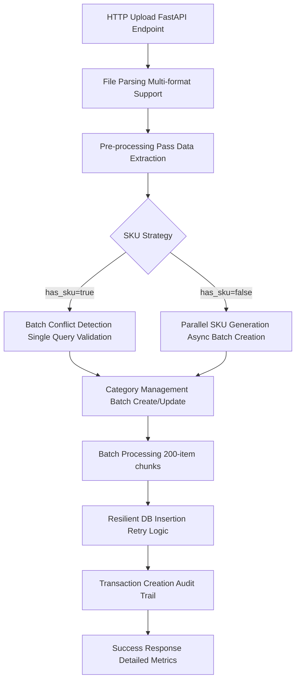
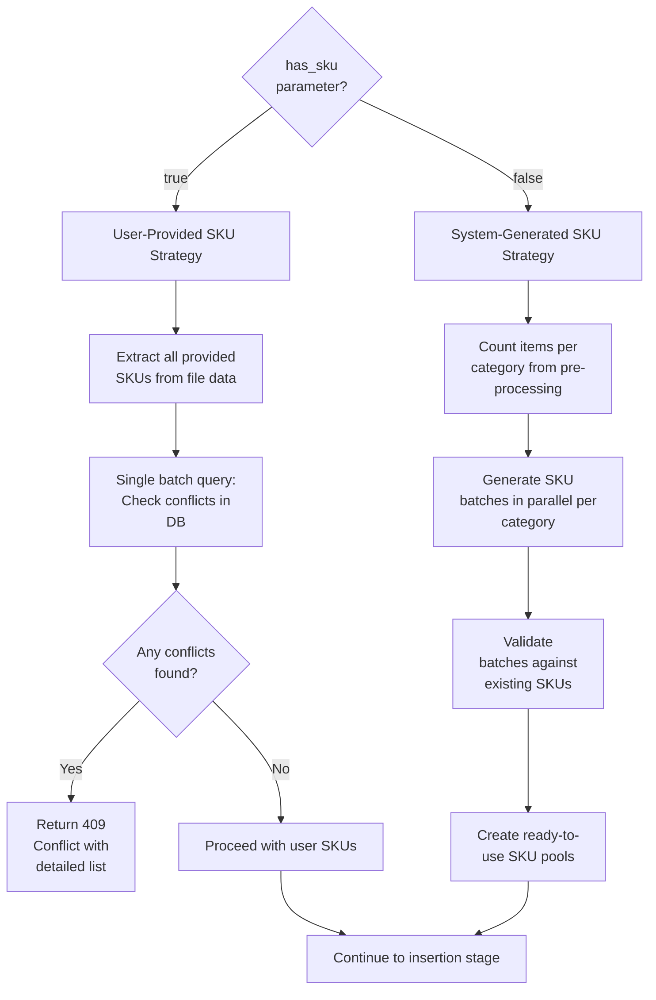

::: callout info
> Check out Fisco, a business operations management application on [https://usefisco.com](https://usefisco.com).
:::

## Scenrario

A large retailer with 50,000 SKUs decides to migrate their inventory to [Fisco](https://usefisco.com). They upload their carefully prepared CSV file, watch the progress bar crawl to 99%, and then... **crash**. The entire import fails with an unhelpful 500 Internal Server Error. Hours of work, gone.

_The first few iterations of the import inventory failed woefully._

## The Hidden Complexities

**Data Integrity Challenges:**
- Handling malformed data, encoding issues, and schema mismatches
- Preventing duplicate SKUs within the same upload
- Avoiding conflicts with existing inventory items
- Managing referential integrity across categories and business boundaries

**Performance Bottlenecks:**
- The infamous `N+1` query problem (one query per row = death)
- Memory exhaustion with large files
- Database connection pool saturation
- Lock contention during concurrent imports

**Concurrency Nightmares:**
- Multiple users uploading simultaneously
- Race conditions between SKU generation and insertion
- Partial failures requiring complex rollback logic
- Maintaining ACID properties across thousands of operations

## System Architecture: A Multi-Stage Pipeline

My solution is a sophisticated pipeline that isolates concerns, maximizes parallelism, and provides multiple layers of resilience. Built on **FastAPI** and **Beanie ODM** (asyncio-native MongoDB ODM), the system processes files through distinct, optimized stages.



### Key Architectural Principles

1. **Asynchronous by Design**: Every I/O operation is non-blocking, enabling high concurrency
2. **Batch Everything**: Transform O(N) operations into O(1) or O(log N) operations
3. **Fail Fast, Recover Smart**: Validate early, but handle failures gracefully
4. **Isolation of Concerns**: Each stage has a single responsibility and clear interfaces
5. **Observable and Debuggable**: Comprehensive logging and metrics at every stage

## Intelligent File Processing and Parsing

The first stage demonstrates that even "simple" file parsing requires sophisticated engineering when done at scale. [Fisco](https://usefisco.com) supports 7 different file formats through a pluggable parser architecture:

```python
# From fisco/utilities/inventory_utils.py

def parse_document(filename: str, content: bytes) -> List[Dict[str, Any]]:
    """
    Parse documents with intelligent format detection and fallback strategies.
    Supports: CSV, Excel (XLSX/XLS), PDF, DOCX, TXT, JSON, XML
    """
    ext = os.path.splitext(filename)[1].lower()
    
    parser_mapping = {
        ".csv": parse_csv,
        ".xlsx": parse_excel, ".xls": parse_excel,
        ".pdf": parse_pdf,
        ".docx": parse_docx,
        ".txt": parse_txt,
        ".json": parse_json,
        ".xml": parse_xml
    }
    
    if ext in parser_mapping:
        return parser_mapping[ext](content)
    else:
        # Fallback: attempt regex-based parsing
        return parse_with_regex(content)
```

### The Excel Parser: Handling Real-World Messiness

Excel files are particularly tricky because users create them in unpredictable ways. Our parser handles common issues like:

```python
def parse_excel(content: bytes) -> List[Dict[str, Any]]:
    """
    Robust Excel parser handling:
    - BOM (Byte Order Mark) characters
    - Inconsistent header formats
    - Empty rows and columns
    - Auto-generated column names
    """
    # Skip the first row (often contains formatting) and use predefined headers
    df = pd.read_excel(BytesIO(content), skiprows=1, names=[
        "SKU", "Name", "Description", "Price", "Quantity In Stock",
        "Reorder Point", "Reorder Quantity", "Unit Of Measure", "Category"
    ])

    # Strip BOM characters that break column matching
    df.columns = [col.strip().lstrip('\ufeff') for col in df.columns]
    
    return df.to_dict(orient="records")
```

### Memory-Efficient Pre-processing

Once parsed, we perform a critical **single-pass analysis** of the entire dataset. This step eliminates the need for multiple scans and sets up optimal batch operations:

```python
# From fisco/services/inventory.py

async def load_inventory_from_file(self, user: User, has_sku: bool, file: UploadFile):
    # Parse entire file into memory (acceptable for files up to 100MB)
    inventory_list = parse_document(file.filename, await file.read())
    
    # Single pass extraction - crucial optimization
    unique_categories = set()
    provided_skus = set()
    category_counts = defaultdict(int)

    for row in inventory_list:
        # Normalize category names for consistency
        cat = row.get("Category", "general").lower()
        unique_categories.add(cat)
        category_counts[cat] += 1

        # Collect user-provided SKUs for validation
        if has_sku and row.get("SKU"):
            provided_skus.add(row["SKU"])
```

This single loop gives us complete knowledge about the import, allowing us to:
- Pre-fetch all required categories in one query
- Validate all SKU conflicts in one query  
- Pre-generate SKUs in optimal batch sizes
- Calculate accurate progress metrics

## The SKU Collision Problem - A Tale of Two Strategies

This dealt with me a lot. Initially, I assumed there won't be any reoccurence with regards the SKU and it worked for the first few entries - 100, 500, 1000. As it grew, it started failing with a duplicate error with the SKU and it became frustrating. My naive solution was to do an `if...else` but that wasn't efficient enough.

Stock Keeping Units (SKUs) must be unique within a business's inventory. The `has_sku` boolean parameter creates a strategic fork in our processing logic, each optimized for different scenarios.



### Strategy 1: User-Provided SKUs - Trust but Verify

When users provide their own SKUs, we implement a **fail-fast validation** strategy:

```python
# Parallel data fetching for optimal performance
if provided_skus:
    provided_sku_check_task = InventoryItem.find(
        In(InventoryItem.SKU, list(provided_skus)),
        InventoryItem.owned_by == user_business.id
    ).project(InventoryItemProj).to_list()

# Execute multiple database operations concurrently
category_task = InventoryCategory.find(
    In(InventoryCategory.name, list(unique_categories)),
    InventoryCategory.owned_by == user_business.id
).to_list()

all_existing_skus_task = InventoryItem.find(
    InventoryItem.owned_by == user_business.id
).project(InventoryItemProj).to_list()

# Await all operations simultaneously
existing_categories, all_existing_sku_docs = await asyncio.gather(
    category_task, all_existing_skus_task
)

if provided_sku_check_task:
    provided_conflicts = await provided_sku_check_task
    conflicting_skus = {doc.SKU for doc in provided_conflicts}
    
    if conflicting_skus:
        raise HTTPException(
            status_code=409,
            detail=f"The following SKUs already exist: {', '.join(conflicting_skus)}"
        )
```

### Strategy 2: System-Generated SKUs - The Scaling Challenge

This is where the real engineering complexity lies. Generating unique identifiers at scale requires careful orchestration to avoid the dreaded `N+1` query problem.

**My Initial Naive Approach (Don't Do This):**
```python
# This will kill your database
for item in inventory_list:
    while True:
        candidate_sku = generate_sku(item.category)
        if not await check_sku_exists(candidate_sku):  # N database calls!
            item.sku = candidate_sku
            break
```

**Improved Solution: Batched Pre-generation**
```python
async def _prepare_sku_batches(self, category_counts, existing_skus):
    """
    Pre-generate SKUs in batches with intelligent buffering.
    Transforms O(N) database calls into O(categories) calls.
    """
    sku_batches = {}
    tasks = []

    # Create concurrent generation tasks for each category
    for category, count in category_counts.items():
        # Buffer calculation: balance memory vs. collision risk
        buffer_size = max(count + 10, int(count * 1.2))
        task = self._generate_sku_batch(category, buffer_size)
        tasks.append((category, task))

    # Execute all generation tasks in parallel
    for category, task in tasks:
        generated_skus = await task
        # Filter against known existing SKUs
        unique_skus = [sku for sku in generated_skus if sku not in existing_skus]
        sku_batches[category] = unique_skus
        
    return sku_batches
```

## Batched Asynchronous SKU Generation

The heart of fisco is the sophisticated SKU generation pipeline that can create thousands of unique identifiers with minimal database load.

### The Generation Algorithm

```python
async def _generate_sku_batch(self, category: str, count: int) -> List[str]:
    """
    Generate a batch of SKUs with intelligent retry and validation.
    
    Performance characteristics:
    - Time: O(count + log(existing_skus))
    - Database queries: 1 per batch (not per SKU)
    - Memory: O(count) 
    """
    skus = []
    attempts = 0
    max_attempts = count * 2  # Prevent infinite loops

    while len(skus) < count and attempts < max_attempts:
        # Generate candidates in memory first
        batch_size = min(50, count - len(skus))
        candidate_skus = []
        
        for _ in range(batch_size):
            # SKU format: CATG-12345 (category prefix + 5 digits)
            prefix = category[:4].upper()
            number = ''.join(random.choices(string.digits, k=5))
            candidate_skus.append(f"{prefix}-{number}")

        # Single database query to check entire batch
        existing_check = await InventoryItem.find(
            In(InventoryItem.SKU, candidate_skus)
        ).project(InventoryItemProj).to_list()

        # Filter out existing SKUs
        existing_set = {doc.SKU for doc in existing_check}
        unique_skus = [sku for sku in candidate_skus if sku not in existing_set]
        
        skus.extend(unique_skus)
        attempts += batch_size

    return skus
```

### Handling Edge Cases: Regeneration Logic

What happens when our initial batch doesn't generate enough unique SKUs? fisco includes sophisticated regeneration logic:

```python
# Check for insufficient batches and regenerate
regeneration_tasks = []
for category, count in category_counts.items():
    current_count = len(sku_batches[category])
    if current_count < count:
        shortage = count - current_count
        # Generate extra to handle potential duplicates
        regenerate_count = max(shortage + 5, int(shortage * 1.5))
        task = self._generate_sku_batch(category, regenerate_count)
        regeneration_tasks.append((category, shortage, task))

# Process regeneration results
for category, needed_count, task in regeneration_tasks:
    additional_skus = await task
    existing_category_skus = set(sku_batches[category]) | existing_skus

    # Add until we have enough, avoiding internal duplicates
    for sku in additional_skus:
        if sku not in existing_category_skus:
            sku_batches[category].append(sku)
            existing_category_skus.add(sku)
            if len(sku_batches[category]) >= category_counts[category]:
                break
```

### SKU Distribution Strategy

During processing, we use a smart distribution mechanism to pull from our pre-generated batches:

```python
async def _get_next_available_sku(self, category: str, sku_batches: Dict[str, List[str]],
                                  sku_counters: Dict[str, int], all_used_skus: Set[str]) -> str:
    """
    Efficiently distribute SKUs from pre-generated batches with fallback logic.
    """
    # Try to use pre-generated batch first
    if category in sku_batches and sku_counters[category] < len(sku_batches[category]):
        candidate_sku = sku_batches[category][sku_counters[category]]
        if candidate_sku not in all_used_skus:
            sku_counters[category] += 1
            return candidate_sku

    # Fallback: generate individual SKU if batch is exhausted
    max_attempts = 10
    for _ in range(max_attempts):
        candidate_sku = await generate_unique_sku(category)
        if candidate_sku not in all_used_skus:
            return candidate_sku

    raise ValueError(f"Failed to generate unique SKU for category {category}")
```

## Resilient Database Insertion with Atomic Retry Logic

Even with perfect pre-generation, race conditions can still occur. Our final stage implements a sophisticated retry mechanism that handles partial failures gracefully.

### The Challenge: Race Conditions in Distributed Systems

Consider this scenario:
1. Process A generates SKU "SHOE-12345" 
2. Process B generates the same SKU "SHOE-12345" (due to random collision)
3. Process A successfully inserts its item
4. Process B attempts insertion and fails with duplicate key error

Our system must handle this elegantly without losing data or corrupting state.

### Optimistic Insertion with Intelligent Retry

```python
async def _insert_batch_with_retry(self, items_to_insert: List[InventoryItem], 
                                   business_id: PydanticObjectId,
                                   max_retries: int = 3) -> List[InventoryItem]:
    """
    Insert batches with atomic retry logic for handling race conditions.
    
    Key features:
    - Ordered=False for maximum throughput
    - Specific error code handling (11000 = duplicate key)
    - Partial success tracking
    - Atomic SKU regeneration for failed items
    """
    successful_items = []
    remaining_items = items_to_insert.copy()

    for attempt in range(max_retries + 1):
        if not remaining_items:
            break

        try:
            # Attempt optimistic batch insertion
            result = await InventoryItem.insert_many(remaining_items, ordered=False)
            
            # Success: update item IDs and track insertions
            for item, item_id in zip(remaining_items, result.inserted_ids):
                item.id = item_id
                successful_items.append(item)
                
            remaining_items = []  # All succeeded

        except BulkWriteError as e:
            # Parse detailed error information
            write_errors = e.details.get('writeErrors', [])
            inserted_count = e.details.get('nInserted', 0)
            
            # Handle partial success: some items were inserted
            if inserted_count > 0:
                error_indices = {error['index'] for error in write_errors}
                
                for idx, item in enumerate(remaining_items):
                    if idx not in error_indices and idx < inserted_count:
                        successful_items.append(item)

            # Isolate and handle duplicate key errors specifically
            duplicate_items = []
            for error in write_errors:
                if error.get('code') == 11000:  # MongoDB duplicate key error
                    error_index = error['index']
                    if error_index < len(remaining_items):
                        duplicate_item = remaining_items[error_index]
                        duplicate_items.append((error_index, duplicate_item))

            if not duplicate_items:
                # Non-duplicate errors are not retryable
                logger.error(f"Non-duplicate bulk write error: {e}")
                break

            # Regenerate SKUs for duplicate items atomically
            new_remaining_items = []
            for error_index, item in duplicate_items:
                if attempt < max_retries:
                    category_name = await self._get_category_name(item.category_id)
                    new_sku = await self._generate_guaranteed_unique_sku(
                        category_name, business_id
                    )
                    item.SKU = new_sku
                    new_remaining_items.append(item)
                    
                    logger.info(f"Reassigned SKU for duplicate item: {new_sku}")

            remaining_items = new_remaining_items

    return successful_items
```

### Guaranteed Unique SKU Generation

When retries are needed, we use an even more robust generation method:

```python
async def _generate_guaranteed_unique_sku(self, category_name: str, 
                                          business_id: PydanticObjectId,
                                          max_attempts: int = 50) -> str:
    """
    Generate a SKU with database verification, used for conflict resolution.
    
    This method trades performance for absolute guarantees.
    """
    for attempt in range(max_attempts):
        candidate_sku = await generate_unique_sku(category_name)

        # Verify uniqueness with direct database check
        existing = await InventoryItem.find_one({
            "SKU": candidate_sku,
            "owned_by": business_id
        })

        if not existing:
            return candidate_sku

        # Add small delay to prevent thundering herd
        if attempt > 10:
            await asyncio.sleep(0.01)

    # Ultimate fallback: timestamp-based uniqueness
    import time
    fallback_sku = f"{await generate_unique_sku(category_name)}-{int(time.time() * 1000) % 10000}"
    return fallback_sku
```    

### Key Optimizations

**1. Batching Strategy**
```python
BATCH_SIZE = 200  # Optimal balance of memory vs. transaction overhead

for i in range(0, total_items, BATCH_SIZE):
    batch_items = inventory_list[i:i + BATCH_SIZE]
    # Process batch atomically
```

**2. MongoDB Projection Optimization**
```python
# Only fetch required fields to reduce network overhead
.project(InventoryItemProj)  # Only SKU and ID fields

# Defined as:
class InventoryItemProj(BaseModel):
    SKU: str
    id: Optional[PydanticObjectId] = None
```

**3. Concurrent Database Operations**
```python
# Execute multiple independent queries simultaneously
category_task, sku_task, conflict_task = await asyncio.gather(
    fetch_categories(),
    fetch_existing_skus(), 
    check_conflicts()
)
```

**4. Memory Management**
```python
# Use generators for large datasets to prevent memory exhaustion
def process_in_chunks(items, chunk_size=1000):
    for i in range(0, len(items), chunk_size):
        yield items[i:i + chunk_size]
```

### Configuration Tuning

```python
# Production configuration values
BATCH_SIZE = 200              # Balance memory vs. transaction cost
MAX_RETRIES = 3               # Prevent infinite retry loops  
SKU_BUFFER_MULTIPLIER = 1.2   # Account for collisions
MAX_FILE_SIZE = 100_000_000   # 100MB limit
SKU_GENERATION_BATCH_SIZE = 50 # Optimal for MongoDB $in queries
```

## Conclusion & Notes

Now, I wasn't particular about the processing speed but ensuring it worked. Now that it works and the collision of SKUs is eliminated, I'm exploring better ways to handle this -> handle uploads and processing in the background so users can focus on other things.

- Imports with SKUs are faster than those without. This makes sense, lesser computation required.

Thanks to Claude, I was able to combine the scattered pieces for this implementation.