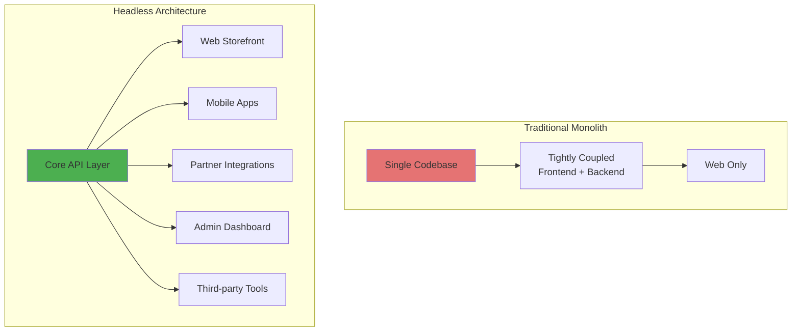
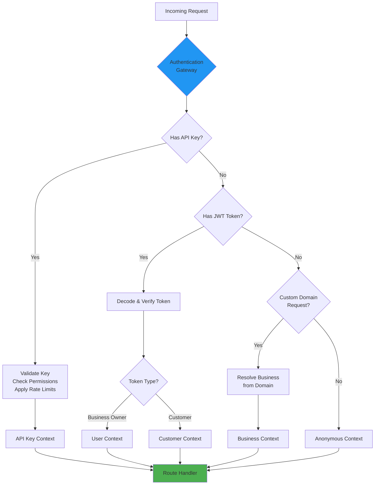
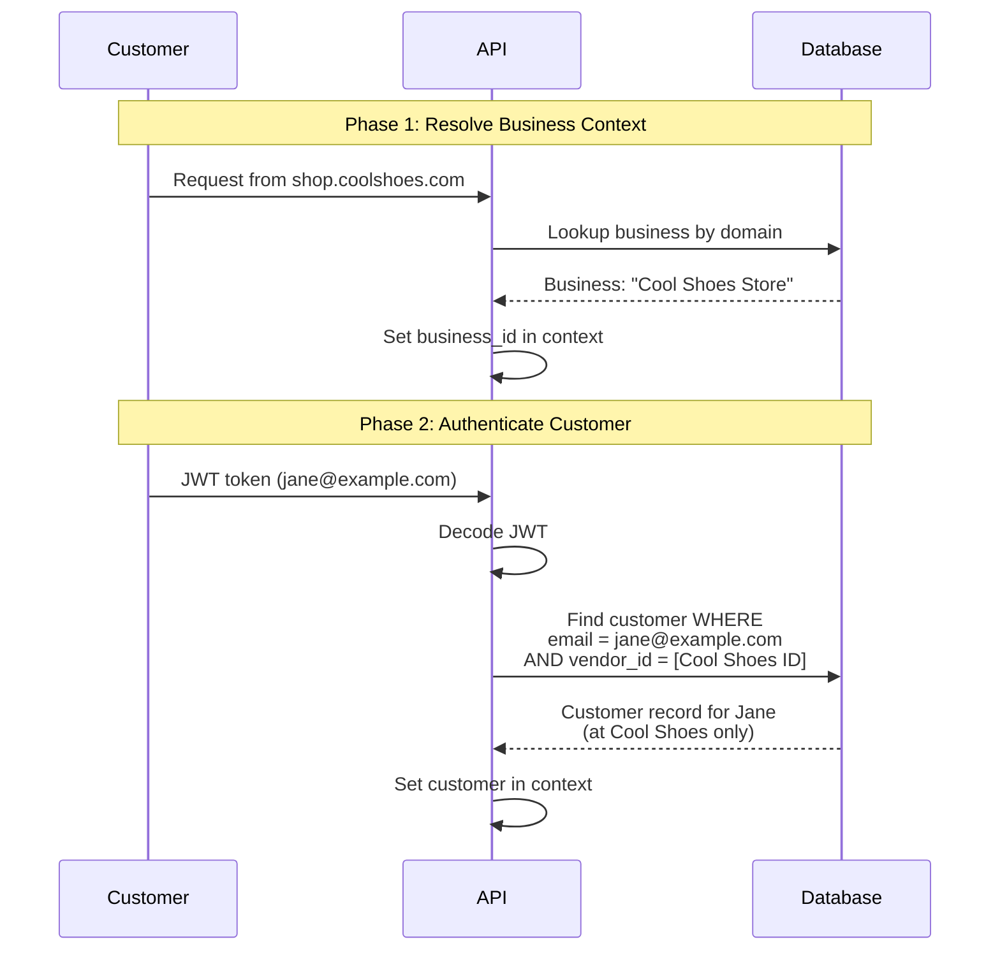
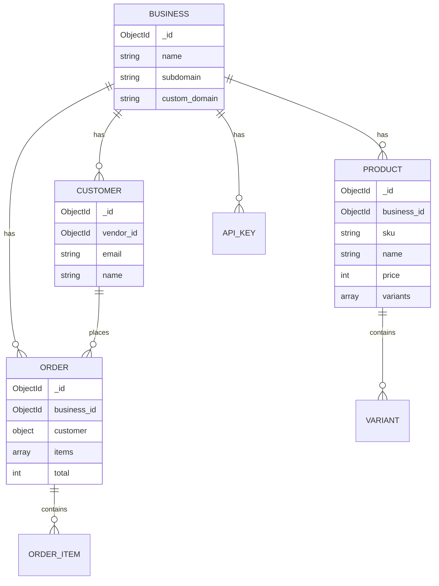

::: callout info
> Check out Fisco, a business operations management application on [https://usefisco.com](https://usefisco.com).
:::

When we started building Fisco, we had a choice: follow the well-trodden path of monolithic e-commerce platforms, or embrace the complexity of headless architecture. We chose the latter later, and here's why.

## Why Headless?

Traditional e-commerce platforms bundle everything together — your product catalog, checkout flow, admin dashboard, and storefront all live in one codebase. This works great until you want to:

- Build a mobile app that feels native, not like a web view
- Let partners integrate your inventory into their own systems
- Run A/B tests on your checkout flow without deploying your entire backend
- Serve customers through voice assistants, kiosks, or IoT devices

That’s where headless architecture shines. By exposing our entire platform through APIs, we enable clients to consume our commerce engine in any way they prefer. Your React storefront? Check. Flutter mobile app? Sure. Integration with your existing Rails application? Why not.



But going headless isn’t just about flexibility—it’s about performance. When designing an API-first platform, every millisecond counts. Our goal from day one was simple: keep API response times under 100ms at the 95th percentile.

This article walks through how we built the authentication layer, designed our database schemas, and optimized for speed. Along the way, we'll share the mistakes we made and the patterns that actually worked.

## The Authentication Puzzle

Here’s the thing about headless platforms: authentication gets complicated fast.

In a traditional e-commerce setup, you have users who log in with a username and password. Maybe you can add social login. That's it. But in a headless world, you need to support:

- API keys for headless storefronts and third-party integrations
- Business owner sessions for your admin dashboard
- Customer sessions for shoppers, but here's the catch—the same email can be a customer at multiple different storefronts

That last one nearly tripped us up early on. Imagine jane@example.com shops at Store A and Store B, both powered by Fisco. When she logs into Store A's checkout, we can't accidentally show her order history from Store B. We needed proper tenant isolation baked into authentication from the start.

### How Authentication Flows Through the System

Every request that hits our API goes through an authentication gateway that figures out who (or what) is making the request:



This looks complex, but it handles our three main authentication patterns elegantly. Let's break each one down.

### Pattern 1: API Keys That Don't Suck

API keys are the backbone of any headless platform. Partners need them to build integrations, headless storefronts need them to fetch products, and automation scripts need them to sync inventory.

We learned quickly that there’s a right way and a wrong way to do API keys.

Here's our current approach:

#### 1. Generate cryptographically secure keys

When a business creates an API key, we generate it using a cryptographically secure random number generator (not Math.random(), which is predictable. The key looks like this:

`sk_abc12345_x7K9mP2nQ8vL4wR1tY5zH3jF6gD0sA9b`

The prefix tells us the key type:

- `pk_` = Public keys (safe to expose in frontend code)
- `sk_` = Secret keys (backend only, full permissions)

#### 2. Hash it immediately

The moment we generate that key, we hash it with SHA-256 and store only the hash in our database. The actual key is shown to the user exactly once, then it’s gone forever. Even if someone steals our entire database, they can’t use the keys without the original strings.

```py
import hashlib
import secrets

def generate_api_key(business_id: str, key_type: str):
    # Generate the key
    prefix = “pk” if key_type == “public” else “sk”
    random_bytes = secrets.token_urlsafe(32)
    full_key = f”{prefix}_{business_id[:8]}_{random_bytes}”
    
    # Hash for storage
    key_hash = hashlib.sha256(full_key.encode()).hexdigest()
    
    # Display prefix for UI (helps users identify keys)
    key_prefix = f”{full_key[:15]}...”
    
    return {
        "key": full_key,        # Show once, never again
        "hash": key_hash,       # Store this
        "prefix": key_prefix    # Show in dashboard
    }
```

#### 3. Validate efficiently

When a request comes in with an API key, we hash the provided key and look it up:

```py
async def validate_api_key(provided_key: str):
    key_hash = hashlib.sha256(provided_key.encode()).hexdigest()
    
    key_doc = await db.api_keys.find_one({
        “key_hash”: key_hash,
        “is_active”: True
    })
    
    if not key_doc:
        raise UnauthorizedError(”Invalid API key”)
    
    # Check expiration
    if key_doc.get(”expires_at”) and key_doc[”expires_at”] < datetime.now():
        raise UnauthorizedError(”Expired API key”)
    
    # Check rate limits
    if await rate_limit_exceeded(key_doc[”_id”]):
        raise TooManyRequestsError(”Rate limit exceeded”)
    
    return key_doc
```

#### Granular Permissions

Not all API keys are created equal. A key used by a mobile app to browse products shouldn’t be able to delete inventory or process refunds.

We implemented a permission system where each key has a list of allowed operations:

# Example key document in MongoDB

```json
{
    “_id”: ObjectId(”...”),
    “business_id”: ObjectId(”...”),
    “key_hash”: “a1b2c3...”,
    “key_prefix”: “sk_abc12345_...”,
    “permissions”: [
        “inventory:read”,
        “orders:create”,
        “customers:read”
    ],
    “rate_limit”: 1000,  # requests per hour
    “is_active”: True,
    “created_at”: “2024-11-01T10:00:00Z”
}
```

In our route handlers, we check permissions like this:

```py
@api.delete(”/inventory/{item_id}”)
async def delete_inventory_item(item_id: str, auth: AuthContext):
    # This raises an exception if permission is missing
    auth.require_permission(”inventory:delete”)
    
    # Business logic
    await db.inventory.delete_one({
        “_id”: ObjectId(item_id),
        “business_id”: auth.business_id
    })
    
    return {"deleted": True}
```

#### Rate Limiting That Actually Works

Incessant requests can be intentionally executed or not, but it’s better safe than sorry. We track API key usage in a separate collection:

```py
async def check_rate_limit(key_id: ObjectId, limit: int) -> bool:
    one_hour_ago = datetime.now() - timedelta(hours=1)
    
    # Count recent requests
    count = await db.api_usage.count_documents({
        “key_id”: key_id,
        “timestamp”: {”$gte”: one_hour_ago}
    })
    
    if count >= limit:
        return True  # Rate limit exceeded
    
    # Log this request
    await db.api_usage.insert_one({
        “key_id”: key_id,
        “timestamp”: datetime.now()
    })
    
    return False
```

We set default limits at 1,000 requests per hour for most keys, with higher limits available for enterprise customers.

### Pattern 2: Multi-Tenant Customer Authentication

This was probably the trickiest part of our authentication system to get right.

Here's the scenario: Jane signs up as a customer at "Cool Shoes Store" using jane@example.com. Later, she shops at "Awesome Gadgets Store" (also powered by Fisco) using the same email. These are completely separate businesses—they shouldn't see each other's customer data.

#### Two-Phase Authentication

We solve this with a two-phase approach:



##### Phase 1: Resolve Business Context

Before we even look at the JWT, we figure out which business this request is for. This happens in three ways:

- **Custom domain**: Request comes from `shop.coolshoes.com` → lookup business by domain
- **API key**: The key belongs to a specific business → use that business ID
- **Subdomain**: Request to `coolshoes.fisco.store` → parse subdomain

```py
async def resolve_business_context(request):
    # Check for API key first
    if api_key := request.headers.get(”X-API-Key”):
        key_doc = await validate_api_key(api_key)
        return key_doc[”business_id”]
    
    # Check custom domain
    host = request.headers.get(”Host”)
    business = await db.businesses.find_one({”custom_domain”: host})
    if business:
        return business[”_id”]
    
    # Check subdomain
    if host.endswith(”.fisco.store”):
        subdomain = host.split(”.”)[0]
        business = await db.businesses.find_one({”subdomain”: subdomain})
        if business:
            return business[”_id”]
    
    raise BadRequestError("Cannot determine business context")
```

##### Phase 2: Authenticate Customer Within Business

Now that we know which business we’re dealing with, we can safely authenticate the customer:

```py
async def authenticate_customer(request, business_id: ObjectId):
    # Get JWT from cookie or header
    token = request.cookies.get(”customer_token”) or \
            request.headers.get(”Authorization”, “”).replace(”Bearer “, “”)
    
    if not token:
        return None  # Anonymous customer
    
    # Decode and verify JWT
    try:
        payload = jwt.decode(token, SECRET_KEY, algorithms=[”HS256”])
    except jwt.InvalidTokenError:
        raise UnauthorizedError(”Invalid token”)
    
    # CRITICAL: Always filter by business context
    customer = await db.customers.find_one({
        “email”: payload[”email”],
        “vendor_id”: business_id  # Tenant isolation!
    })
    
    if not customer:
        raise UnauthorizedError(”Customer not found”)
    
    return customer
```

The key line is `"vendor_id": business_id`. Without this, we'd look up Jane's email across all businesses and might return the wrong customer record. With it, we guarantee that Jane at Cool Shoes is completely separate from Jane at Awesome Gadgets.

### Pattern 3: Unified Authorization

At this point, we have three different ways to authenticate:

- API keys
- Business owner sessions
- Customer sessions

But our route handlers shouldn't care about these differences. They just want to know: "Does this request have permission to do X?"

We built an `AuthContext` abstraction that works for all three:

```py
class AuthContext:
    “”“Unified authorization context for all auth types”“”
    
    def __init__(self, auth_type: str, business_id: ObjectId, 
                 permissions: set, user=None, customer=None):
        self.auth_type = auth_type  # “api_key” | “user” | “customer”
        self.business_id = business_id
        self.permissions = permissions
        self.user = user
        self.customer = customer
    
    def has_permission(self, permission: str) -> bool:
        return permission in self.permissions
    
    def require_permission(self, *permissions: str):
        “”“Raise error if any permission is missing”“”
        missing = [p for p in permissions if p not in self.permissions]
        if missing:
            raise ForbiddenError(
                f”Missing permissions: {’, ‘.join(missing)}”
            )
    
    @property
    def is_authenticated(self) -> bool:
        return self.auth_type != “anonymous”
```

Now our route handlers look the same regardless of auth type:

```py
@api.get(”/orders/{order_id}”)
async def get_order(order_id: str, auth: AuthContext):
    # Works for API keys, users, and customers
    auth.require_permission(”orders:read”)
    
    order = await db.orders.find_one({
        “_id”: ObjectId(order_id),
        “business_id”: auth.business_id
    })
    
    # Customers can only see their own orders
    if auth.auth_type == “customer” and order[”customer_id”] != auth.customer[”_id”]:
        raise ForbiddenError(”Cannot access other customers’ orders”)
    
    return order
```

Clean, consistent, and secure.

## Database Design: Embracing Document Flexibility

When we started designing Fisco's database schema, I went with MongoDB, and here's why it made sense for e-commerce (anything to use MongoDB tbh).

### The E-Commerce Schema Problem

E-commerce data is inherently messy and flexible:

- Clothing has sizes, colors, and materials
- Electronics have technical specs and warranty info
- Books have ISBNs, authors, and page counts
- Digital products have download links and license keys

MongoDB's document model embraces this variability. Each product can have its own structure while still being queryable.

### Core Schema Patterns

Let's walk through the main collections and why we designed them the way we did.



#### Products with Variants

This is one of our most complex schemas. A t-shirt isn’t just one product—it’s a combination of sizes, colors, and maybe materials. We needed to support this without creating separate products for each combination.

Here’s how we model it:

```json
{
    “_id”: ObjectId(”...”),
    “business_id”: ObjectId(”...”),
    “sku”: “TSHIRT-001”,
    “name”: “Premium Cotton T-Shirt”,
    “description”: “Soft, breathable, and ethically made”,
    “price”: 2000,  // Price in kobo (always use integers for money!)

    
    // Variant configuration
    “has_variants”: true,
    “variant_options”: [
        {
            “name”: “Size”,
            “values”: [”S”, “M”, “L”, “XL”, “XXL”]
        },
        {
            “name”: “Color”,
            “values”: [”Black”, “White”, “Navy”, “Gray”]
        }
    ],
    
    // Actual variant combinations with inventory
    “variants”: [
        {
            “sku”: “TSHIRT-001-M-BLACK”,
            “attributes”: {”Size”: “M”, “Color”: “Black”},
            “quantity”: 45,
            “price_adjustment”: 0,
            “weight”: 200  // grams
        },
        {
            “sku”: “TSHIRT-001-XXL-BLACK”,
            “attributes”: {”Size”: “XXL”, “Color”: “Black”},
            “quantity”: 12,
            “price_adjustment”: 500,  // +N5 for XXL
            “weight”: 220
        }
        // ... more variants
    ],
    
    // Metadata
    “images”: [
        “https://cdn.usefisco.com/images/tshirt-001-1.jpg”,
        “https://cdn.usefisco.com/images/tshirt-001-2.jpg”
    ],
    “category”: “Apparel”,
    “visible”: true, // for storefornt
    “created_at”: “2024-11-01T10:00:00Z”,
    “updated_at”: “2024-11-15T14:30:00Z”
}
```

IIRC, there was an issue some years back or something of the sort where floats caused havoc in a Nigerian fintech. Since then, I’ve been cautious of the data format to store values and constantly QA-ing.

Why embed variants instead of separate documents?

- **Atomic updates**: When we update stock, we update one document
- **Single query**: Fetching a product and all its variants = one database round trip
- **Consistency**: Variants can't exist without the parent product

The trade-off is document size (MongoDB has a 16MB limit per document), but for most products, this isn't an issue.

#### Orders: The Art of Denormalization

Orders are interesting because they need to capture a point-in-time snapshot of everything. If a customer changes their email or a product’s name changes, historical orders should reflect the data at the time of purchase, not the current state.

So we denormalize aggressively:

```json
{
    “_id”: ObjectId(”...”),
    “name”: “ORD-2024-11-001”,
    “business_id”: ObjectId(”...”),
    
    // Snapshot of customer data at order time
    “customer”: {
        “email”: “jane@example.com”,
        “name”: “Jane Doe”,
        “phone”: “+1234567890”
    },
    
    // Shipping address snapshot
    “address”: {
        “line1”: “123 Main Street”,
        “line2”: “Apt 4B”,
        “city”: “Lagos”,
        “state”: “Lagos”,
        “country”: “NG”,
        “postal_code”: “100001”
    },
    
    // Order items with historical data
    “items”: [
        {
            “product_id”: ObjectId(”...”),
            “sku”: “TSHIRT-001-M-BLACK”,
            “name”: “Premium Cotton T-Shirt”,  // Name at purchase time
            “variant_description”: “Size: M, Color: Black”,
            “quantity”: 2,
            “unit_price”: 2000,  // Price at purchase time
            “subtotal”: 4000
        }
    ],
    
    // Order timeline
    “status”: “delivered”,
    “timeline”: [
        {
            “status”: “pending”,
            “timestamp”: “2024-11-01T10:00:00Z”,
            “note”: “Order created”
        },
        {
            “status”: “paid”,
            “timestamp”: “2024-11-01T10:05:23Z”,
            “payment_method”: “card”,
            “transaction_id”: “ch_1234567890”
        },
        {
            “status”: “processing”,
            “timestamp”: “2024-11-01T11:00:00Z”,
            “note”: “Preparing shipment”
        },
        {
            “status”: “delivered”,
            “timestamp”: “2024-11-05T14:22:00Z”
        }
    ],
    
    // Pricing
    “subtotal”: 4000,
    “shipping_cost”: 500,
    “tax”: 360,
    “total”: 4860,
    “currency”: “NGN”,
    
    // Metadata
    “created_at”: “2024-11-01T10:00:00Z”,
    “updated_at”: “2024-11-05T14:22:00Z”
}
```

This schema might look redundant, but it's intentional:

- Customer changed their email? Old orders still show the original email
- Product gets renamed? Old orders show the name at purchase time
- Price increases? Historical orders reflect what was actually paid

#### Customers: Simple But Scoped

Customer documents are straightforward, but the key is proper scoping:

```json
{
    “_id”: ObjectId(”...”),
    “vendor_id”: ObjectId(”...”),  // CRITICAL: Which business this customer belongs to
    “email”: “jane@example.com”,
    “name”: “Jane Doe”,
    “phone”: “+1234567890”,
    “password_hash”: “$2b$10$...”,  // hash
    
    // Saved addresses
    “address”: "1 Koledowo Steet, Afi Suuru Ave"
    
    “created_at”: “2024-01-15T08:30:00Z”,
    “updated_at”: “2024-11-01T10:00:00Z”
}
```

The `vendor_id` field is non-negotiable. Every customer query must include it:

# ALWAYS do this

```py
customer = await db.customers.find_one({
    “email”: email,
    “vendor_id”: business_id  # Tenant isolation
})

# NEVER do this (security vulnerability!)
customer = await db.customers.find_one({"email": email})
```

### Indexing Strategy: The Performance Multiplier

Indexes are how you go from 500ms queries to 5ms queries. Here's what we learned.

#### Rule #1: Index Your Multi-Tenant Filters

Every collection has `business_id` or `vendor_id`. These MUST be indexed, and they should be the first field in compound indexes:

```py
// Orders: Business + creation date
db.orders.createIndex({”business_id”: 1, “created_at”: -1})

// Inventory: Business + SKU lookup
db.inventory.createIndex({”business_id”: 1, “sku”: 1})

// Customers: Vendor + email lookup
db.customers.createIndex({”vendor_id”: 1, “email”: 1}, {unique: true})

// API keys: Fast hash validation
db.api_keys.createIndex({"key_hash": 1}, {unique: true})
```

#### Rule #2: Support Your Common Queries

Look at your slow query logs and create indexes that match your query patterns:

```py
// Query: Find active products, sorted by price
db.inventory.createIndex({
    “business_id”: 1,
    “is_active”: 1,
    “base_price”: 1
})

// Query: Find orders by customer
db.orders.createIndex({
    “business_id”: 1,
    “customer._id”: 1,
    “created_at”: -1
})

// Query: Search products by name
db.inventory.createIndex({
    “business_id”: 1,
    “name”: “text”
})
```

#### Rule #3: Don’t Over-Index

Every index slows down writes. We learned this the hard way when we had 15+ indexes on our orders collection, and inserts started taking 100ms. We pruned it down to the 6 most important indexes, and performance improved dramatically.

## Lessons Learned

Building Fisco taught us a lot. Here are the biggest lessons (Authentication & Database-wise):

### 1. Design for Multiple Auth Contexts from Day One

We initially built user authentication, then bolted on API keys later. This was painful. If we could do it over, we'd design the auth layer to support multiple contexts from the start.

**Lesson**: Your first API endpoint should work with both user sessions and API keys.

### 2. Multi-Tenancy is Non-Negotiable

Every query must filter by `business_id` or `vendor_id`. No exceptions. We caught several bugs early where queries forgot this filter and returned data across tenants.

**Lesson**: Make tenant isolation a middleware concern, not something each route handler remembers.

### 3. Denormalize for Reads, Normalize for Writes

Orders embed customer data because we read orders way more than we create them. But we don't embed order data in customer records because that would make customer updates expensive.

**Lesson**: Optimize your schema for your read/write ratio.