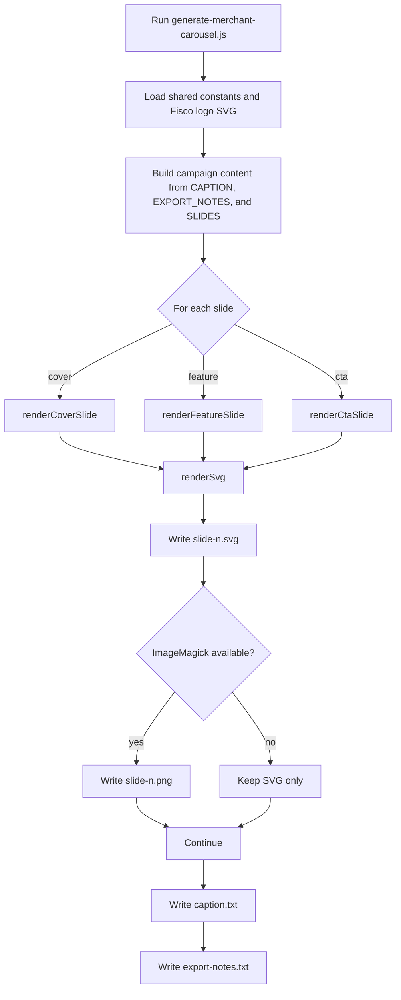
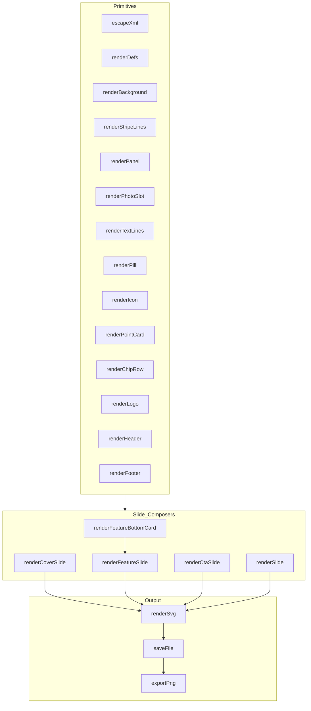
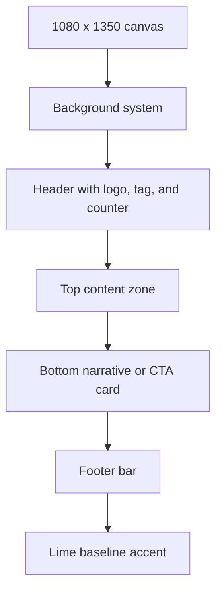

The implementation covered here is `generate-merchant-carousel.js`, which produces a seven-slide Meta carousel for Razak of Suavee Studios. The broader idea, though, is larger than one campaign: encode the brand system, layout rules, and slide structure in code so a campaign can be regenerated quickly, consistently, and with far less manual setup.

At a high level, the generator does three jobs:

- turns campaign copy into a structured slide model
- renders each slide as SVG using reusable layout primitives
- exports production-friendly assets and handoff notes

The result is a repeatable asset pipeline for a format that normally becomes slow and error-prone once it has to be produced at volume.

## What the generator produces

When the script runs, it creates:

- `slide-1.svg` through `slide-7.svg`
- `slide-1.png` through `slide-7.png` if ImageMagick is available via `magick`
- `caption.txt`
- `export-notes.txt`

One detail is worth calling out immediately: this script does not generate the `story.svg` or `story.png` files currently sitting in the same folder. Those are separate assets.

## Why we build this in code

Merchant carousels look simple on the surface, but they usually combine several systems at once:

- a rigid slide sequence
- a consistent visual language
- merchant-specific copy and imagery
- export requirements for platform upload
- repeated production tasks that change from campaign to campaign but not from slide to slide

If all of that lives only inside a design tool, every new carousel starts with manual reconstruction. That slows production down and creates more room for inconsistency.

By moving the layout rules into code, we get a different workflow:

- the composition system becomes reusable
- the brand treatment stays consistent by default
- changes can be made centrally and regenerated in seconds
- handoff files such as captions and production notes can be created automatically

This approach is especially effective for campaigns where the visual system remains stable and the story changes from merchant to merchant.

## The asset pipeline at a glance

The generator is SVG-first. That design decision shapes the entire workflow.



SVG is the source of truth. PNG is a convenience export layered on top.

That matters for two reasons. First, SVG is precise and readable, which makes it a strong intermediate format for a design system built from panels, labels, geometry, and type. Second, it keeps the composition logic inspectable. The output is not a black box.

## Running the generator

From the repository root:

```bash
node fisco/generate-merchant-carousel.js
```

The script writes everything back into its own directory because `OUT_DIR` is set to `__dirname`.

## Dependencies

The implementation is intentionally lightweight. It uses only Node's built-in modules:

- `fs`
- `path`
- `child_process.execFileSync`

There are no npm dependencies.

The only optional external dependency is ImageMagick. If `magick` is available on the machine, the script converts each generated SVG into a PNG. If it is not installed, the script still completes successfully and leaves SVG as the final output format.

## The core design: content model plus layout engine

Everything in this generator lives inside one file, but conceptually it splits into two layers:

- a content layer that describes the campaign
- a rendering layer that knows how to draw it

The content layer is expressed through constants such as `CAPTION`, `EXPORT_NOTES`, and most importantly `SLIDES`.

The rendering layer is a set of small functions that build SVG fragments and assemble them into complete slides.

That split is what makes the script useful. The campaign is specific, but the composition logic is mostly reusable.

## How the slide model works

The editorial center of the generator is the `SLIDES` array. Each entry describes one slide in the sequence.

There are three slide types:

| Type | Purpose | Renderer |
| --- | --- | --- |
| `cover` | Introduce the merchant and set the story up | `renderCoverSlide` |
| `feature` | Explain a specific business or product value | `renderFeatureSlide` |
| `cta` | Close the carousel with the shop and product call to action | `renderCtaSlide` |

Feature slides carry most of the flexible data. In this implementation they define:

- `eyebrow`
- `headline`
- `body`
- `chips`
- `align`
- `photoLabel`
- `photoSubLabel`
- `cards`

That means the generator is data-driven at the slide level. It is not fully data-driven at the campaign level, because some merchant-specific strings still live directly inside the rendering functions.

## How the rendering system is structured

The rendering layer is easiest to understand as three tiers: primitives, slide composers, and output utilities.



This is a simple architecture, but it is disciplined. The generator is not one long string template. It is a small composition system.

## The reusable SVG primitives

The bottom layer is a collection of small functions that each do one visual job.

### `escapeXml(value)`

This is the safety layer for text insertion. Any copy that ends up in SVG text nodes, titles, or descriptions gets escaped first so characters such as `&` or `<` cannot break the markup.

### `renderDefs()`

This function defines the shared gradients used across the carousel, including the glass panel treatment and card fills. In the current version, `glassPanel`, `cardPanel`, and `photoWash` are used. `oliveAccent` is defined but not currently consumed.

### `renderBackground()` and `renderStripeLines()`

These two functions establish the visual signature of the campaign:

- a cream upper field
- a softer lower field
- diagonal stripe texture across the upper section
- a lime baseline at the bottom edge

The stripe pattern is generated algorithmically by drawing diagonal lines at a fixed interval. That keeps the texture consistent without storing any static background asset.

### `renderPanel(x, y, width, height, radius)`

This is the core card primitive used throughout the system. It creates a panel by stacking:

- a shadow layer
- a glass-style outer shell
- an inset cream interior

Because the same function is reused everywhere, the different slide layouts still feel like one design system.

### `renderPhotoSlot(...)`

This function is important because it explains one of the system's boundaries. It does not insert a real image. Instead, it creates a structured placeholder with:

- a framed photo area
- a pale image wash
- a lime corner accent
- an abstract illustration stand-in
- a label describing the intended photo type
- a sublabel guiding production on what image should go there

In other words, the generator automates layout and handoff scaffolding, not final photo compositing.

### `renderTextLines(lines, ...)`

Text is not automatically wrapped. Instead, copy is pre-broken into arrays inside `SLIDES`, and this function renders each line at a fixed offset.

That is a deliberate tradeoff. It gives editorial control over line breaks, but it also means copy changes have to be managed carefully.

### `renderPill(...)` and `renderChipRow(...)`

These functions generate the rounded badges used for tags, metadata chips, and CTA elements. Width is derived from string length, which makes them flexible without requiring text measurement tooling.

### `renderIcon(name, x, y)`

Each feature card uses a small hand-authored SVG icon. The current implementation supports:

- `shipping`
- `store`
- `inventory`
- `sales`
- `orders`
- `customer`

If the function receives an unsupported name, it falls back to a generic icon. That is relevant here because some cards request `growth`, but `growth` does not have a dedicated branch yet.

### `renderPointCard(...)`

This function combines card shell, icon, title, and supporting copy into a single reusable feature card. Slides 2 through 6 use it to create the vertical stack beside the main photo panel.

## How complete slides are assembled

Once the primitives exist, the generator uses a small set of composite renderers to assemble full slides.

### `renderHeader(tag, index)`

The header establishes the shared chrome at the top of every slide:

- the Fisco logo
- a right-aligned campaign tag
- a slide counter

The badge width is calculated from the tag text, while the counter uses `TOTAL_SLIDES`. That detail becomes important later, because the count is maintained separately from the slide array.

### `renderFooter(label)`

Every slide ends with the same maroon footer bar containing the main URL and a contextual right-aligned label.

### `renderFeatureBottomCard(slide)`

This is the lower copy panel used on feature slides. It renders the eyebrow, headline, supporting copy, divider line, and chip row.

### `renderCoverSlide(index, slide)`

The cover slide is a special layout. It uses:

- one large portrait slot
- two supporting image slots
- a large merchant introduction card

This is also where the current implementation reveals that it is campaign-specific. The merchant handle and storefront are hardcoded directly into the renderer for this version.

### `renderFeatureSlide(index, slide)`

This is the workhorse renderer for the middle of the carousel. Its main layout switch is `align`:

- `left` places the photo on the left and the feature cards on the right
- `right` flips that arrangement

That alternating rhythm is a simple but useful design choice. It stops the middle slides from feeling mechanically repeated while still preserving the same visual system.

### `renderCtaSlide(index, slide)`

The final slide widens the image area and shifts into a two-panel CTA layout: one side points to the merchant storefront, the other points to Fisco's product entry points.

Like the cover slide, this renderer still contains hardcoded merchant-specific text in the current implementation.

### `renderSlide(slide, index)`

This is the dispatcher that chooses the right renderer based on `slide.kind`.

## The slide composition pattern

Even though the slides differ in layout, they all follow the same broad structure.



That shared frame is what makes the set feel like a campaign instead of a collection of unrelated statics.

## How the seven-slide story is structured

The carousel uses a narrative progression rather than a set of disconnected claims.

| Slide | Role in the story | Layout behavior |
| --- | --- | --- |
| 1 | Introduce the merchant and set context | Three photo slots plus a large intro card |
| 2 | Show the merchant running on Fisco | Left photo, right card stack |
| 3 | Focus on shipping and delivery flow | Right photo, left card stack |
| 4 | Focus on store and inventory visibility | Left photo, right card stack |
| 5 | Focus on sales visibility and reaction speed | Right photo, left card stack |
| 6 | Reframe the benefit as calmer operations and growth | Left photo, right card stack |
| 7 | Close with merchant storefront plus Fisco CTA | Wide image slot and two CTA panels |

That progression matters. The carousel starts with proof, moves through operational value, and closes with action.

## Export behavior and graceful degradation

At the bottom of the file, the script loops through `SLIDES`, renders each one, saves the SVG, and then tries to create a PNG version.

The PNG export path is deliberately lightweight:

```bash
magick input.svg output.png
```

If that command fails, the error is caught and the script continues.

That makes the generator resilient, but it also creates a visibility tradeoff:

- failed PNG conversions do not emit detailed diagnostics
- the console does not identify which file failed
- the final `pngExported` flag only tells us whether at least one PNG export succeeded

So when `export-notes.txt` says PNG exports were generated, that does not prove every slide converted successfully. It only proves the pipeline succeeded at least once.

## What the generator automates and what it does not

This is not a one-button final-art system. It is a layout generator with production handoff built in.

What the code automates:

- brand-consistent slide structure
- header, footer, and panel system
- copy placement
- placeholder image zones
- caption export
- handoff note export
- optional PNG conversion

What still requires human production work:

- selecting the final merchant photography
- replacing the placeholder slots with real imagery
- checking crops, type fit, and visual balance
- approving and uploading the finished assets

That split is deliberate. The code handles consistency and speed. Human production still handles taste, judgment, and final polish.

## Current limitations in this implementation

This generator works well for a campaign-specific build, but it is not fully generalized yet.

### Slide count is duplicated

`TOTAL_SLIDES` is maintained separately from `SLIDES.length`, which creates an avoidable maintenance risk.

### Some merchant data is still hardcoded

The current renderers still embed values such as:

- `@Bobissenpai`
- `suaveestudios.com`
- merchant-specific descriptor copy

That makes reuse slower than it needs to be.

### Text wrapping is manual

Because line breaks are authored directly in arrays, the copy stays visually controlled, but the system does not adapt automatically when text length changes.

### The `growth` icon is not implemented

Some slides request `growth`, but the icon renderer does not define it. Those cards currently fall back to the default icon.

### Export reporting is minimal

The PNG export path is intentionally forgiving, but it is not very observable.

### Image composition is still external

The SVG output is template-ready rather than final-photo-ready.

### Some parameters are unused

For example:

- `renderLogo(x, y, width, height)` accepts width and height but does not use them
- `oliveAccent` is defined in the gradients but not applied in the output

## How we would generalize it further

If this system needed to support many merchants, the next step would not be a redesign. It would be parameterization.

The cleanest path would be:

1. move merchant metadata into a separate config object or content file
2. derive `TOTAL_SLIDES` from `SLIDES.length`
3. move hardcoded merchant strings out of the renderers
4. add a dedicated `growth` icon
5. improve PNG export reporting with per-file success and failure output
6. optionally support real image embedding if final composites need to be generated entirely from code

## The practical workflow

In practice, the production loop looks like this:

1. update merchant content in `generate-merchant-carousel.js`
2. run the Node script
3. review the generated SVG slides
4. confirm PNG exports if upload-ready rasters are needed
5. swap placeholder image areas for approved photography
6. review `caption.txt` and `export-notes.txt`

## Closing thought

What makes this generator useful is not that it replaces design. It does not. What it replaces is repetitive setup.

By encoding the slide system in SVG and JavaScript, we can regenerate a merchant carousel quickly, keep the brand treatment consistent, and hand production a structured package instead of a blank canvas. That is the real value of this approach.

This specific file is still tailored to one merchant story, but the underlying pattern is already clear: once a social format becomes repeatable, it becomes a good candidate for code.