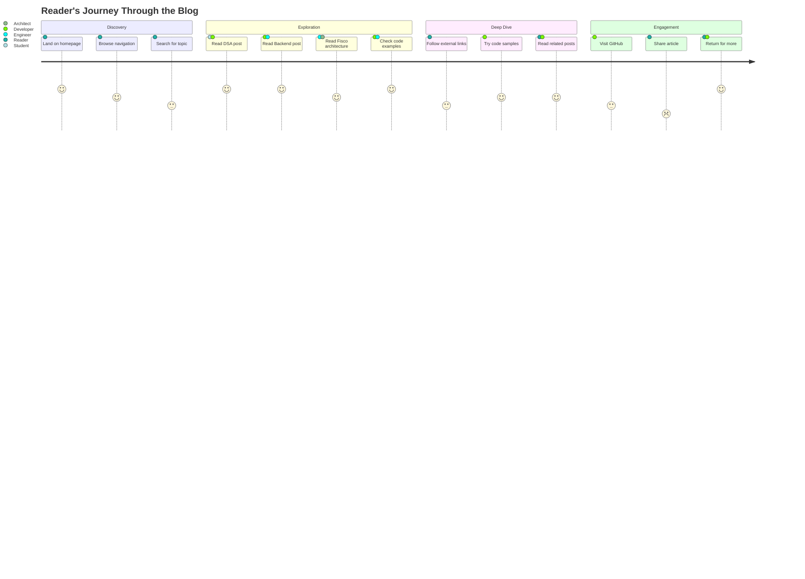

# Welcome to My Engineering Blog

This is my open repository for engineering activities carried out personally or for companies I'm permitted to write about. Here you'll find deep dives into backend engineering, data structures & algorithms, blockchain, and the technical challenges I've encountered while building real-world applications.

## Reader's Journey

Explore how different readers navigate through this blog based on their interests:

## What You'll Find Here

### 🏗️ Building Fisco
Real-world e-commerce engineering - from headless architecture to optimizing batch imports for scale.

### 🧮 Data Structures & Algorithms
Practical explorations of linked lists, recursion, arrays, and algorithm challenges with clear explanations.

### ⚙️ Backend Engineering
MongoDB change streams, search engines, authentication systems, WebSockets, and monitoring dashboards.

### ⛓️ Blockchain & Web3
Building on Cosmos, creating crowdfund modules, and exploring decentralized applications.

### 📚 Projects & Challenges
Coding challenges, treasure hunters, and collaborative problem-solving sessions.

---

**Start exploring** using the navigation menu, or jump directly to the latest deep-dive on [Headless Commerce Architecture](/fisco-headless-arch).